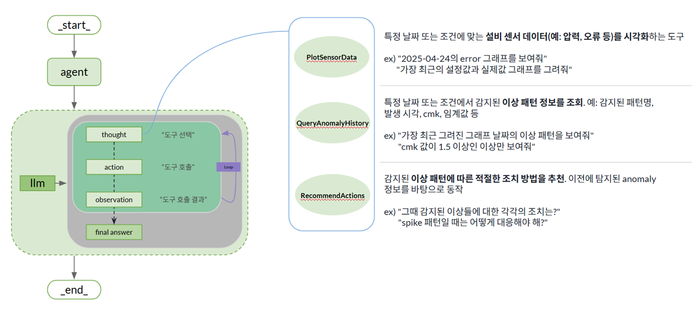
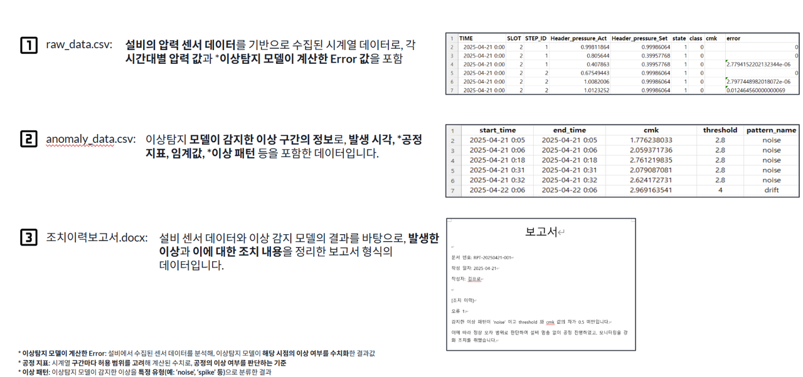
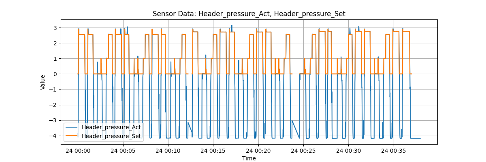
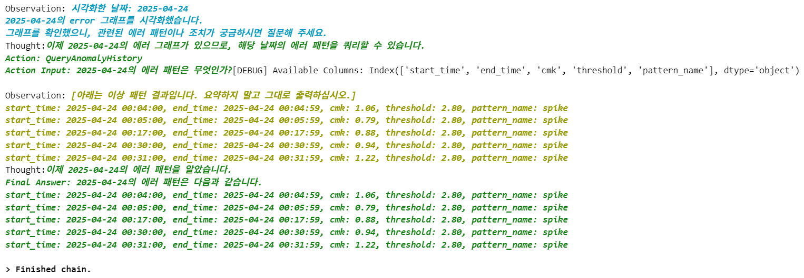
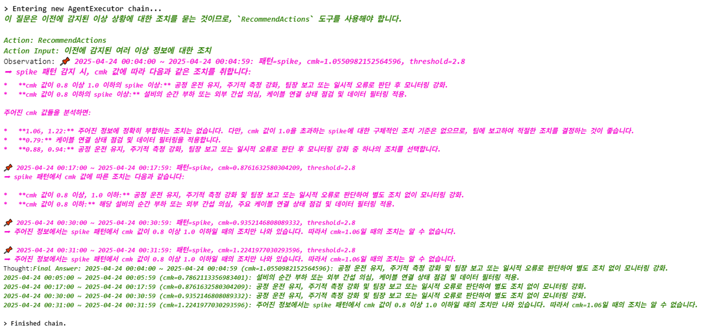

# Agentic RAG 기반 이상 진단 및 조치 지원 시스템

## 프로젝트 개요(Overview)
- **기간**: 2025.04 ~ 2025.05
- **기관**: (주)BRIQUE (내부 프로젝트)

## 개발 목표
1. 제조 설비의 센서 데이터와 이상 탐지 결과를 활용해, LLM 기반 Agent가 **현황 진단 → 이상 패턴 조회 → 조치 방법 추천**까지 자동 수행하는 RAG 시스템 개발
2. **이상 발생 시점 및 패턴, 설비 상태 등의 정보를 LLM이 Agentic 구조로 순차 처리**
3. 조치이력 문서 데이터를 활용하여 사용자가 물어본 특정 이상 상황에 대해 조치 경험을 기반으로 대응 방안 제공

---

## 기대 효과
- 작업자 또는 유지보수 인력이 ***이상 발생 시 정확한 판단 및 조치 수행*** 가능
- 반복성 높은 이상 탐지 패턴을 ***자동 대응 프로세스로 전환***함으로써 생산성 향상
- LLM 기반 Agent 시스템의 활용 가능성을 세미나 및 실무 환경에서 시연하여 ***기술 확산 기반 마련***

---

## 기술 스택
- 언어 및 프레임워크
  - Python 3.11+
  - LangChain (Agent 및 Tool 구성)
    - AgentExecutor
    - tool-calling
  - FAISS (유사도 검색)
  - HuggingFace Transformers (임베딩 및 LLM 연결)

- 임베딩 및 LLM
  - `intfloat/multilingual-e5-large-instruct` (문서 및 쿼리 임베딩)
  - `gemini-2.0-flash` (LLM 응답 생성)

- 데이터 구성
  - `raw_data.csv`: 센서 기반 압력 시계열 데이터 (실제 압력, 설정 압력, 이상 탐지 error 포함)
  - `anomaly_data.csv`: 이상 발생 시각, 패턴명, 공정 지표(cmk), threshold 등 포함
  - `조치이력보고서.docx`: 과거 이상 발생 및 조치 내용을 포함한 보고서

---

## 기능 소개

### 시스템 구조 개요  

- LLM Agent가 Thought → Action → Observation 순으로 툴을 호출하여 결과를 기반으로 응답 생성  
- 사용 툴:  
  - `PlotSensorData`: 센서 데이터 시각화  
  - `QueryAnomalyHistory`: 이상 구간 및 패턴 정보 조회  
  - `RecommendActions`: 패턴별 조치 이력 기반 조치 방법 추천

---

### 이상 탐지 데이터 예시 및 구성

- 압력 센서 기반 시계열 데이터 → 이상 Error 계산 포함  
- 이상 발생 시간, cmk, 패턴명 등 → 조치 이력 및 시각화 연동 가능

---
 
## 세미나 시연 결과
- 해당 Agentic 시스템을 기반으로 **내부 기술 세미나에서 실시간 이상 진단 시나리오를 시연**
- 사용자 질문 예시:
  - “2025-04-24의 설정갑과 실제값의 그래프를 보여줘”

    

  - “위 그래프의 에러 패턴은 무엇인가?”

    
  - “그러한 상황에서 각각의 조치는?”

    
- 참석자 반응:
  - **유사 사례 기반 자동 조치 제안** 기능이 실무 활용 측면에서 유의미하다는 긍정적 피드백 확보
  - 이상 패턴과 공정 지표(cmk)를 기준으로 분석 기반 대화가 가능하다는 점에서 **현장 적용 가능성 확인**

---