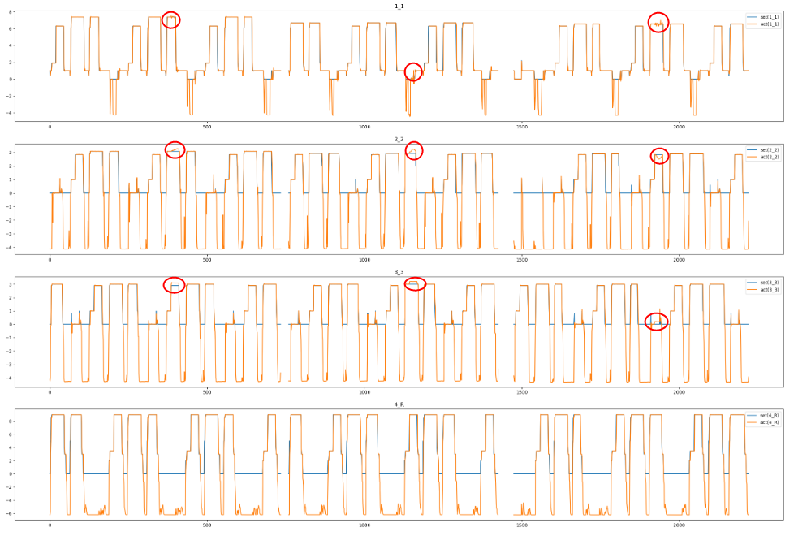
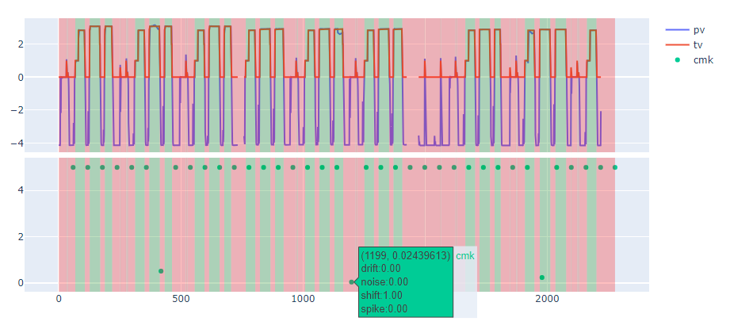
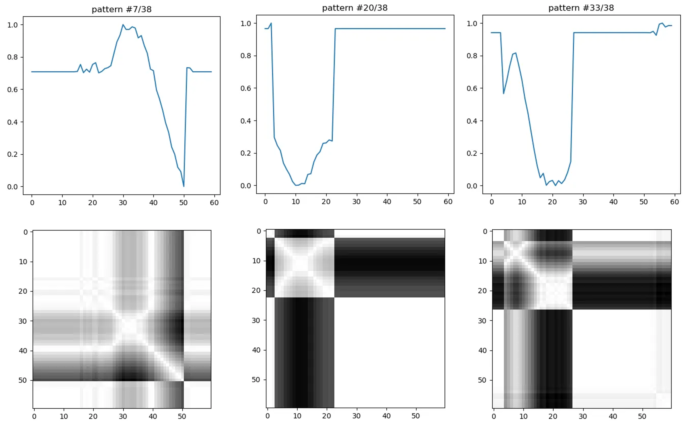

# BRIQUE 이상감지 모델 특허 및 실증

- **기간**: 2023.09 ~ 2025.04
- **기관**: (주)BRIQUE (국책)
- **목표**: 학습 없이도 이상을 탐지할 수 있는 **비학습형 이상감지 모델을 개발**하여, 중소 제조기업이 **적은 데이터로도 쉽게 적용 가능**하도록 지원
- **활용 기술**: BRIQUE's Anomaly Model, EfficientNetB0
- **담당 업무**: <u>**이상감지 모델 개발**</u>, <u>**모델 성능 검증 시나리오 작성 및 실험 수행**</u>, <u>**특허 출원 2건 작성 및 제출**</u>

## 프로젝트 개요
- 중소 제조기업의 설비 센서 데이터를 기반으로, **이상 탐지 및 예지보전 한계를 분석**하고 이를 개선할 수 있는 자체 이상감지 모델을 설계 및 실증한 프로젝트
- 본 프로젝트는 **특허 출원 중인 기술을 바탕으로 진행되었으며**, 구체적인 알고리즘은 비공개 상태

---

## 실험 및 적용 결과

- **실제 설비 압력 데이터**를 기반으로 이상 상황을 실험적으로 삽입하여 **이상 감지 가능성 검증**
- 기존 예지보전 방식에서 발생할 수 있는 **과잉 유지보수** 또는 **이상 누락** 문제를 수치적으로 확인함
- 모델은 복잡한 설정 없이 적용 가능하여, **중소 제조 현장에서의 실질적 활용 가능성 확인**

📎 *시각화 결과 예시:* 

- 특정 구간 이상 데이터가 주입된 데이터셋

- 이상감지 모델 적용

- 이상감지가 판별된 구간의 이상 분류

---

## 기대 효과

- 이상 발생 시점 및 조건을 자동 판별함으로써, **TBM(Time-Based Maintenance) 방식의 한계 극복**
- 판별된 이상의 종류를 예측함으로써 유지보수 효율성 극대화
- 설비 운영 중단 없이 데이터 기반 유지보수 가능성 확보
- **중소 제조 환경에 바로 적용 가능한 경량화된 이상감지 프레임워크** 실증

---

## 비고

> ※ 본 프로젝트는 현재 특허 출원 중이며, 기술적 상세 내용은 비공개 상태입니다.  
> 실험 결과와 실제 적용 가능성 중심으로 요약하여 공개합니다.