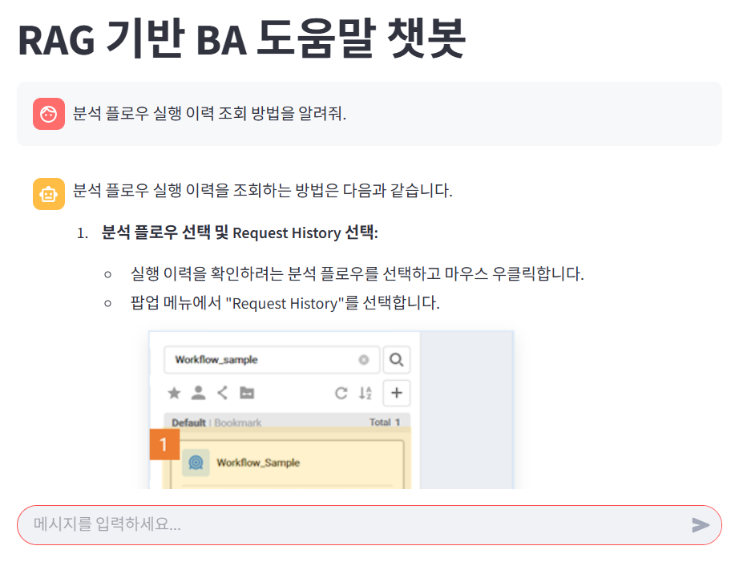

# RAG-Chatbot: BA
## 프로젝트 개요(Overview)
- **기간**: 2025.03 ~ 2025.04
- **기관**: (주)BRIQUE (내부 프로젝트)
- **담당 업무**: 파이프라인 구축, 검색 기능 개선, 프롬프트 개선 등 프로젝트 범위 전체

## 개발 목표 
1. Local LLM 또는 외부 API를 활용한 RAG 챗봇 개발
2. 이미지가 포함된 Markdown 문서를 임베딩하여 검색에 활용
3. 챗봇을 활용하여 Bqirue Analytics 솔루션의 사용설명서 검색 및 정보 제공

## 기대 효과 
- 사용자가 원하는 정보를 빠르게 찾을수 있도록 지원하여 초기 제품 사용 적응을 도움
- 제품 사용에 대한 거부감을 줄이고, 보다 직관적인 방식으로 UX를 개선
- RAG 기반 AI 팻봇 도입 가능성을 평가하여, 향후 제품에 적용할 방향성에 근거 자료로 활용

## 개발 환경
1. 개발 및 실행 언어: Python 3.11.11
2. 터미널: powershell
3. 가상환경 생성
    <br><br>
    다음의 명령어를 터미널(powershell)에서 입력

    ```
    conda create -n 가상환경이름 python=3.11.11
    ```
4. 원격 저장소(git hub)의 프로젝트를 로컬에 복사
    <br><br>
    다음의 명령어를 터미널(powershell)에서 입력

    ```
    git clone https://github.com/******
    ```
5. 필요 라이브러리 설치
    <br><br>
    다음의 명령어를 터미널(powershell)에서 입력

    ```    
    pip install -r requirements.txt
    ```
    
    - 터미널에서 아래의 패키지 추가 설치
    ```
    # if you're running this on a CPU-only envrionment, install:
    pip install faiss-cpu

    # if using GPU with CUDA:
    pip install faiss-gpu
    ```
6. .env 파일 생성
    - 아래를 참고하여 .env 파일을 생성합니다.
        ```
        HUGGINGFACEHUB_API_TOKEN = 'api key'
        GOOGLE_API_KEY = 'api key'
        ```
    - 아래의 링크에서 API KEY를 발급받아주세요.
      - gemini: https://aistudio.google.com/app/apikey?hl=ko
      - huggingface: https://huggingface.co/docs/hub/security-tokens

## 기술 스텍
- 언어 및 프레임워크
  - Python 3.11+
  - Streamlit: 프론트엔드 인터페이스 제공
  - LangCahin: Rag 체인 구성 및 메모리 관리
  - FAISS: 임베딩 기반 유사도 검색 인덱싱
  - Huggign Face Transformer: LLM 및 임베딩 모델 로딩
  - TextLoader: Markdown 및 Text 문서 파싱
- 임베딩 및 LLM
  - jhgan--ko-sroberta-multitask: 문서(Documents) 및 쿼리(Query) 임베딩
  - gemini-2.0-flash (LLM): 질의 응답 생성
- 저장소 및 파일 처리
  - 로컬 파일 시스템
  - Markdown 및 이미지 렌더링 처리


## 기능 소개

- 🔍 문서 기반 질의 응답 (RAG)
  - 사용자가 업로드한 Markdown, Text 에서 정보 추출
  - 문서 내용을 기반으로 질문에 대한 정밀 응답 제공
- 📚 벡터 검색 기반 문서 검색
  - 헤더(Chunk) 단위로 문서를 쪼개어 FAISS 인덱스 구축
  - 쿼리와 유사한 문단 검색 및 추론에 활용
- 💬 대화 메모리 기능
  - 이전 질문을 기억하여 문맥 기반 대화 가능
- 🖼️ Markdown 이미지 자동 렌더링
  - 문서 내 이미지 링크 또는 참조 파일을 자동 표시(출력)
- 🔧 설정 가능한 유사도 임계값
  - 검색 결과 필터링을 위한 score threshold 설정 기능 제공


## 디렉토리 구조
```
RAG-Chatbot
├── README.md
├── app
│   ├── congig.py
│   ├── loader.py
│   ├── vectordb.py
│   ├── retriever.py
│   ├── rag_chain.py
│   ├── streamlit_app.py
├── database
│   ├── 01.분석가                        # 사용 메뉴얼
│   │   └── 00.작성가이드                 # embedding model
│   │   └── 01.기본기능
│   │   └── 02.작성방법
│   │   └── 03.기능활용
│   │   └── 04.사용툴팁
│   │   └── 05.시뮬레이터
│   ├── embedding_model                 
│   │   └── hub
│   │       └── .locks/models--jhgan--ko-sroberta-multitask
│   └── vectorstore
│       ├── index.faiss                 # vectorize text data
├── notebooks
└── requirements.txt
```

## 사용 방법
실행 환경을 구성한 뒤 터미널(Powershell) 을 통해 각 명령어를 실행합니다.

### 실행 환경 구성
- [개발 환경](#개발-환경)에 따라 실행 환경을 구성합니다.

### Data Pipeline
- 데이터 파이프라인 실행
    ```
    python app/vectordb.py
    ```

### Streamlit
- 질문 및 응답 UI 실행
  ```
  streamlit run app/streamlit_app.py
  ```

## 실행 데모 예

