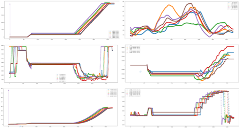
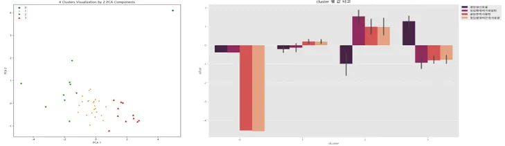
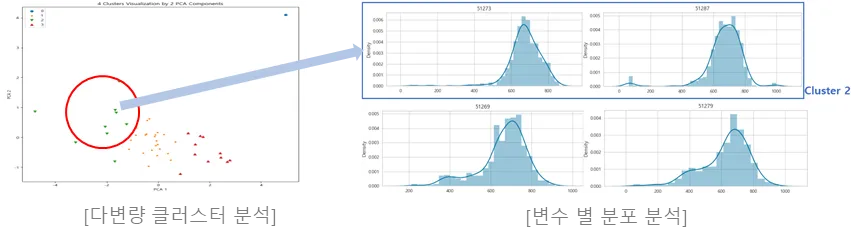

# 제강 공정 최적화 모델링

- **기간**: 2023.11 ~ 2023.12
- **기관**: 동국제강
- **목표**: 스크랩(고철) 타입에 따라 최적 공정 조건을 AI 기반으로 탐색
- **활용 기술**: K-Means, 통계 분석
- **담당 업무**: EDA, Clustering 모델 개발
- **결과**: 검증 후 모델 고도화 계획

## 프로젝트 배경 및 목적
제강 공정에서는 혼재된 스크랩 종류에 따라 설비 설정값이 달라지며, 현재는 작업자의 숙력도에 의존하여 설정값을 결정하고 있음.
AI 및 빅데이터 기반으로 스크랩 타입을 예측하고, 최적 설정값을 탐색하여 공정 효율성을 계선하는 것을 목적으로 함

## 프로젝트 목표 
스크랩 타입을 예측하여 공정 조건을 자동흐올 최적화하는 AI 모델을 개발하고, 이를 통해 설비 운영의 표준화를 목표로 함

## 프로젝트 주제
스크랩 조성에 따른 공정 변수 최적화 모델 개발

## 분석 과정

### 1. 데이터 탐색
- 결측, 중복, 이상 데이터를 탐색 및 처리하여 데이터 품질 확보
- 조업 별(samling) 변수들의 설정값 차이 확인

    
    [각 변수 별 / 조업 별 그래프]

### 2. 가설 설정
- 조업 별 변수들의 설정값의 차이는 스크랩의 차이 때문.
즉, 스크랩을 그룹화 한다면 해당 그룹의 최적 설정값을 탐색할 수 있을 것이다.

### 3. 모델 개발
- 조업 결과 데이터를 Scaling, 차원 축소를 통해 거리 기반 비지도 학습 모델 K-Means를 구현하여 그룹화

## Results
- 스크랩의 물성 데이터나 이미지 분류 없이도 조업 결과 데이터를 Clustering 하여 제강 공정 최적 설정값을 확보할 수 있음을 확인
- 클러스터 간 특정 변수의 분포 차이가 존재함을 증명하여, 스크랩 타입에 따른 조업 설정값 최적화 가능성을 제시
- 최적 Clustering 수 및 조업 결과 데이터의 변수 선정을 위해 고객사가 실험 및 연구를 진행 중이며, 이 후 최적 설정값을 도출하는 고도화 작업을 수행할 계획
