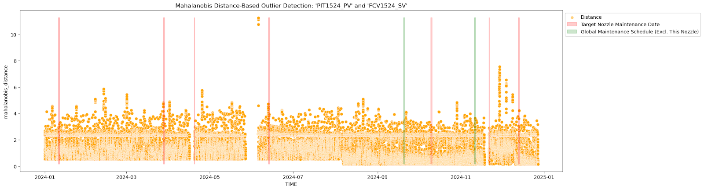

# H사 제철 연주 공정 노즐 이상 탐지 분석 프로젝트

- **기간**: 2025.04 ~ 2025.05
- **기관**: 현대제철
- **목표**: 이상 징후 탐지 지표 및 모델 구축
- **활용 기술**: BRIQUE's Anomaly Model, Mahalanobis Distance, LightGBMRegressor
- **담당 업무**: EDA, Feature Engineering, Modeling, Report
- **결과**: 고객사의 노즐 센서 데이터 이상 감지에 최적화된 모델 개발

##  프로젝트 배경 및 목적
고객사는 연주 공정에서 **일정한 스케줄에 따라 노즐을 교체**하고 있으나, 그 교체 시점이 데이터 기반의 **이상 징후 분석에 근거한 것은 아닌 것으로 확인.**
이는 불필요한 교체로 인한 생산 중단 및 비용 증가로 이어질 수 있음.

이에 따라 해당 철강 회사는 데이터 기반으로 **이상 징후를 사전에 감지**함으로써, **실제 이상이 발생한 경우에만 노즐을 교체하고 그렇지 않은 경우에는 교체를 유예**하여 **생산의 연속성을 확보하고 비용을 절감**하고자 함.

본 분석의 목적은 노즐 이상 발생 전후의 센서 패턴을 파악하고, 다양한 이상 감지 모델을 적용하여 최적의 모델을 도출함으로써, **노즐 교체 시점에 대한 객관적이고 신뢰할 수 있는 기준을 마련**하는 데 있음.

## 프로젝트 목표
- 노즐 센서 데이터 분석을 통해 이상 징후 탐지 지표 및 모델 구축

- 다양한 통계적·머신러닝 기반 모델을 적용하여 가장 설명력 높은 방법론 비교

- 타 노즐에도 적용 가능한 모델 일반화 가능성 검토

## 분석 과정

### 1. 데이터 탐색 (EDA)
분포 분석:

- 압력(PIT1524_PV):
다봉 분포를 보이며, 특정 공정 조건에 따라 압력 단계가 뚜렷하게 구분됩니다. 대부분 0.2 ~ 0.8 bar에 집중되어 있음.

- 유량(FIT1524_PV):
밸브 개폐에 따른 유량 차이가 뚜렷하며, 0 근처와 40~50 L/min 사이에 피크가 있음.

- 밸브 제어(FVC1524_MV_I / FVC1524_SV):
밸브는 주로 닫혀 있거나 정밀 제어 상태에 있으며, 제어 신호와 실제 유량 간 패턴은 비교적 안정적임.

상관관계 분석:

- 실제 유량과 기대 유량 간 상관관계: 0.99 (매우 높음)
- 밸브 제어 신호와 압력/유량 간 상관관계: 0.85~0.95 수준

→ 전체적으로, 설비는 기대한 범위 내에서 안정적으로 작동하고 있음

### 2. 가설 설정
H1: 유지보수 이전 구간에서는 예측 오차 또는 통계적 거리 기반 이상 징후가 크게 나타났다면, 유지보수 직후에는 그 징후가 줄어들 것임.

H2: 데이터에 기반하여 노즐의 교체가 이루어 지지 않으므로, 유지보수 전 이상징후가 무조건 나타나는 것은 아닐 것임.

### 3. 모델 개발
#### 통계 기반 모델
마할라노비스 거리를 통해 센서 간 이상값 탐지. 
거리 급증 시점을 이상 징후로 추정

#### 머신러닝 모델 (LightGBM)
- LightGBM 회귀 모델을 통해 압력과 유량을 각각 예측하여 예측 오차값을 산출하고, 각각의 예측 오차값을 합하여 이상감지를 위한 복합지표를 생성
- 결과적으로, 시점별 예측 어려움이 높은 구간을 수치로 확인

#### BRIQUE's Anomaly Model
- BRIQUE 사의 비학습형 이상감지 모델은 사전 학습 없이도 이상 감지가 가능한 규칙 기반 방식으로, 적은 양의 데이터만으로도 빠르고 안정적으로 적용할 수 있는 이상감지 모델
- 시점 별 정량화된 오차값을 산출한 후, 구간 단위로 공정 기준 허용오차를 반영한 cmk(Capability Index) 지표를 통해 구간 별 이상을 탐지
    - cmk 값은 높을 수록 정상. (상한값은 5로 고정)
    - 구간(관측 범위): 일 단위

- 실제 유지보수가 이루어진 시점에서는 **유의미하게 낮았던 cmk 값이 회복되며**,
- 반대로 유지보수가 누락된 경우(**회색의 수직선**)에는 **지속적으로 높은 cmk 값이 관측**되어 **노즐 성능이 명확히 유지되는 패턴**을 확인
    
    - **노란색 수직선**: 회사의 유지보수 일정에 따라, 해당 노즐이 실제로 유지보수를 수행한 일자
    - **회색 수직선**: 회사의 유지보수 일정에는 포함되어 있었지만, 해당 노즐은 유지보수를 수행하지 않은 일자

## Results
모델의 결과를 시각화하여 유지보수 전후의 패턴을 비교하였을 때,BRIQUE사의 이상감지 모델(BRIQUE’s Anomaly Model)이 가장 높은 설명력을 보임

모델은 다음과 같은 두 가지 핵심 기능을 충족함

- **유지보수가 필요한 시점의 명확한 사전 식별**
- **불필요한 교체를 피할 수 있는 정량적 근거 제공**

이를 통해 고객사는 **노즐의 이상 징후를 사전에 감지하고**, **실제로 교체가 필요한 시점에만 유지보수를 진행함으로써 비용을 절감**하고, **설비 가동의 연속성과 효율성도 확보**할 수 있을 것으로 기대함