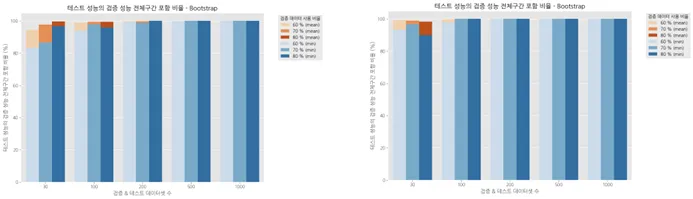
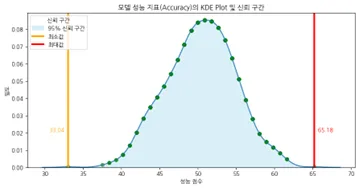

# 모델 성능 신뢰구간 분석

- **기간**: 2024.09 ~ 2024.11
- **기관**: (주)BRIQUE (내부 프로젝트)
- **목표**: AI 모델 성능의 **신뢰구간 산출 방법론 설계 및 검증**
- **활용 기술**: Bootstrap, Repeated Hold-out, Scikit-learn

## 프로젝트 배경 및 목적
학습된 AI 모델의 성능이 검증 데이터에서는 높게 나타나더라도, 실제 현장(off-line 환경) 데이터에 적용했을 때 동일한 성능이 유지되는지는 불확실한 경우가 많음. 
특히 자사 솔루션을 도입한 고객사들로부터, "학습 시 보인 모델 성능이 실제 환경에서도 유지되는지"에 대한 정량적이고 객관적인 근거를 요구받으면서, 이 프로젝트가 시작. 
이에 따라 본 프로젝트는 신뢰구간 기반의 성능 평가 기법을 적용해, 모델 성능의 불확실성을 수치로 표현하고, 실제 환경 적용 시 예상 가능한 성능 범위를 사전에 제시하는 것을 목적으로 함

## 프로젝트 목표 
모델 성능의 신뢰 구간을 산출하여 실제 데이터(off-line)에서의 변동성을 반영한 평가 기준을 제시

## 프로젝트 주제
- AI 모델 신뢰성 평가 및 성능 검증 연구
- MLOps 모델 재학습 및 탐색 기준 설정 연구

## 분석 과정

### 1. 프로젝트 목표 설정 및 활용 방안 정의
- 프로젝트 정의: 실제 데이터에서의 성능 변동성을 반영한 신뢰구간으로 모델 신뢰성을 정의
- 목표 설정: 신뢰성 검증 기법을 개발 및 고객에게 투명한 성능 평가 기준을 제공
- 활용 방안: 자사 솔루션 적용 및 MLOps 에서 모델 재학습 및 탐색 기준(Threshold) 설정에 활용

### 2. 성능 신뢰 구간 산출을 위한 방법론 설계 및 검증
- 반도체 CMP 공정 데이터 외 scikit-learn 의 2종 데이터 수집
- Bootstrap 및 Repeated hold-out 방법으로 검증 데이터를 분할하여 검증 데이터 크기의 60%, 70%, 80%를 사용해 검증 데이터셋 크기를 구성하여, 검증 데이터셋 수를 30, 100, 200, 500, 1000개를 생성
- 학습이 완료된 확정된 모델을 사용하여, 각 검증 데이터셋으로부터 성능 지표(accuracy)의 분포를 확보
- 확보한 성능 지표 분포의 최소값과 최대값, 하위 2.5% 및 상위 97.5%의 구간을 확보하여, 테스트 데이터의 성능이 해당 구간에 포함되는 비율 확인

### 3. 실험 및 결과 분석을 통한 모델 신뢰성 평가
- 검증 데이터 분할 방법: 중복을 허용하는 Bootstrap 방법 선정
- 검증 데이터의 사용 비율에 따라 성능 신뢰구간은 달라짐
- 검증 데이터셋 수에 따라 성능 신뢰구간을 달라짐
- 회귀 및 분류 모형에 따라 사용 검증 데이터셋 수는 다름

## Results
- Bootstrap 방법으로 검증 데이터의 크기를 70%(최소 200개 이상)를 사용해 검증 데이터셋 구성. 1,000개의 검증 데이터셋을 생성(회귀 모형에서는 200개)
- 확보한 성능 지표 분포의 최소값과 최대값을 이용해 95% 신뢰구간으로 설정

    