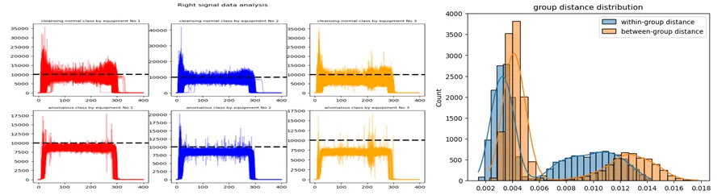
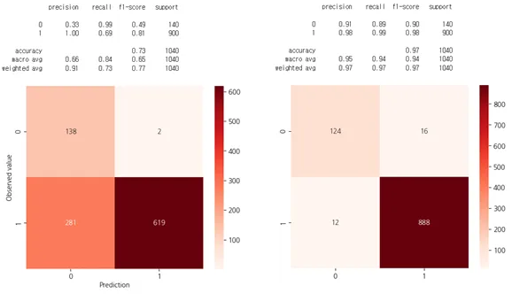

# 용접 공정 품질 예측 모델 개발

- **기간**: 2024.02 ~ 2024.03
- **기관**: 삼성 생산기술연구소
- **목표**: 데이터 불균형 환경에서도 **높은 신뢰도의 품질 예측 모델** 개발
- **기여도**: 80%
- **활용 기술**: DTW, LDA, UMAP, Random Forest
- **담당 업무**: 데이터 탐색 및 가설 설정, AI 기반 품질 예측 모델 개발

## 프로젝트 배경 및 목적
고객사는 공정 최적화를 통해 불량률이 낮았으나, 출고 전 불량을 보다 정확히 예측하여 품질 관리 수준을 향상하고자 함. 데이터 불균형 문제로 인해 기존 품질 예측 모델의 성능 개선이 필요

## 프로젝트 목표 
불량 데이터 비율이 낮은 환경에서도 신뢰할 수 있는 품질 예측 모델 개발 및 데이터 불균형을 고려한 모델링 기법을 적용하여 예측 성능과 실용성을 극대화

## 프로젝트 주제
용접 공정에서의 품질 예측을 위한 M/L 모델 개발

## 분석 과정

### 1. 데이터 Parsing 및 변환
- 고객사로부터 전달받은 데이터는 Parquet 파일 형식으로 개별 파일에는 (400, 1) 형태의 시계열 데이터가 저장
- 파일명에 해당 데이터의 독립 변수 정보가 포함
- 여러 파일명 및 parquet 파일을 병합하여 분석에 적합한 구조의 데이터셋 구축

### 2. 데이터 탐색 및 가설 설정
- 결측치, 중복 데이터, 이상치 탐색 및 처리하여 데이터 품질 확보
- 설비별 신호 패턴이 상이함을 확인하고, 이를 주요 분석 요소로 선정
- 각 시점별 정상 데이터의 평균을 기준으로 DTW 분포를 분석한 결과, 정상 데이터와 비정상 데이터 간의 분포 파이 확인. 
- DTW 기반 클래스 경계가 데이터 불균형 문제에서 중요한 구분 요소임을 가설로 설정

    
    
### 3. 모델 개발
- 설정한 가설을 바탕으로 DTW(Dynamic Time Warping) 변수를 생성하여 데이터 특성을 반영
- 클래스 간 경계를 더욱 명확히 하기 위해, 이진 분류 문제임에도 불구하고 선형판별분석(LDA)을 활용하여 차원을 축소하고 새로운 변수를 생성
- UMAP(Uniform Manifold Apporximation and Projection)의 하이퍼파라미터를 조정하여 클래스 간 거리를 최대화하며, 모델의 분류 성능을 개선
- 최종적으로 Random Forest 모델을 적용하여 학습 및 검증 수행

## Results
- Basedline 모델 대비 아주 우수한 모델 성능 확보
- f1 score 0.73 -> 0.97

[왼) BasedLine-Oneclass SVM, 우)최종 개발 모델-RandomForest]